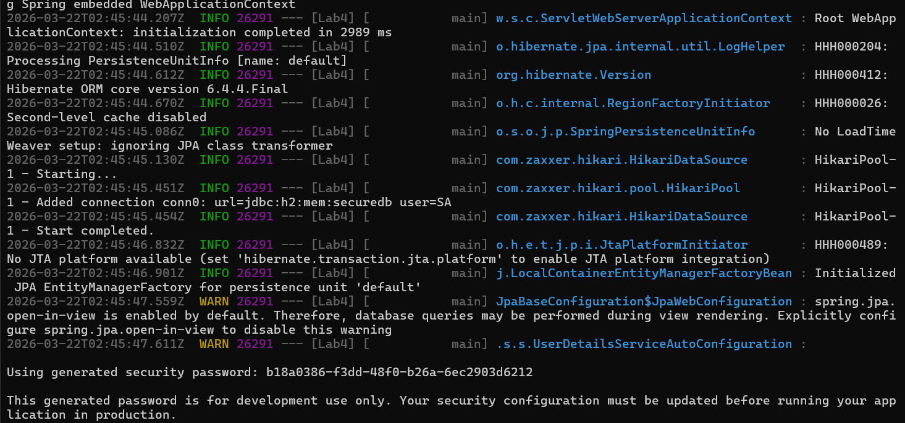
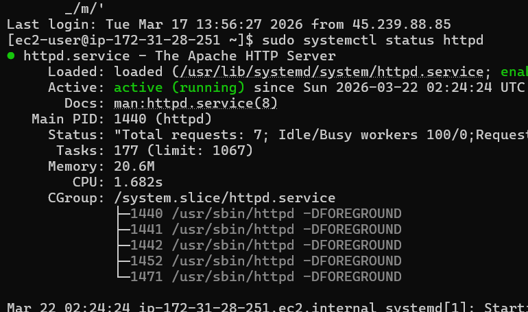
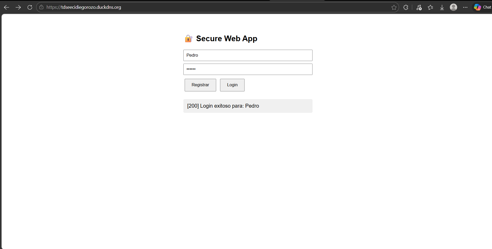
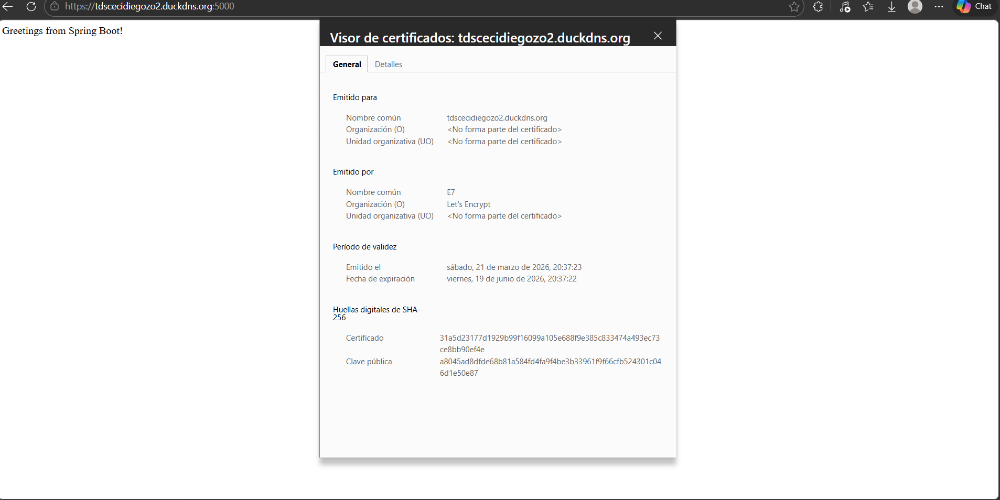
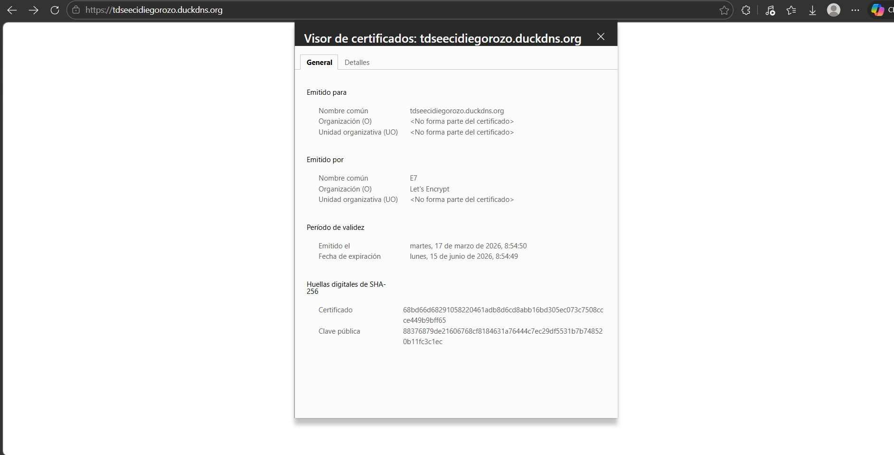

# Secure Application Design — Lab 4

A secure web application with user authentication, HTTPS encrypted communication using Let's Encrypt certificates, deployed on two independent AWS EC2 servers: an Apache server serving the asynchronous HTML+JS client, and a Spring Boot server exposing the REST services.
## Proofs:
**Architecture**
[Architecture](docs/architecture.md)
Or u can download de document if u want.
**Video**: https://youtu.be/B9iIWZz8qAs?si=q89upGymLlymHV5n
## Getting Started

These instructions will get you a copy of the project up and running on your local machine for development and testing purposes. See the **Deployment** section for notes on how to deploy the project on a live system.

### Prerequisites

What you need to install the software:

- Java 17+
- Maven 3.8+
- keytool (included with JDK)

```bash
java -version
# java version "17.0.x"

mvn -version
# Apache Maven 3.x.x
```

### Installing

A step by step series of examples that tell you how to get a development environment running.

1. Clone the repository:

```bash
git clone https://github.com/diegoale8504-hub/-Secure-Application-Design.git
cd -Secure-Application-Design
```

2. Generate the keystore for local HTTPS:

```bash
mkdir -p src/main/resources/keystore
keytool -genkeypair -alias ecikeypair -keyalg RSA -keysize 2048 \
  -storetype PKCS12 -keystore src/main/resources/keystore/ecikeystore.p12 \
  -validity 3650
# When asked for first and last name, enter: localhost
```

3. Build the project:

```bash
mvn clean package -DskipTests
```

4. Run the application:

```bash
mvn spring-boot:run
```

5. Open the browser (accept the self-signed certificate warning):

```
https://localhost:5000/
```

You should see the registration and login form. Register a user and log in to verify the system works correctly.

## Running the tests

### End to end tests

Tests for the authentication endpoints using curl. These tests verify that the authentication system works correctly, that passwords are verified against the stored BCrypt hash, and that the server rejects invalid credentials with the appropriate status code.

```bash
# Register a new user
curl -k -X POST https://localhost:5000/auth/register \
  -H "Content-Type: application/json" \
  -d '{"username":"testuser","password":"testpass123"}'
# Expected: "Usuario registrado exitosamente"
```

```bash
# Successful login
curl -k -X POST https://localhost:5000/auth/login \
  -H "Content-Type: application/json" \
  -d '{"username":"testuser","password":"testpass123"}'
# Expected: "Login exitoso para: testuser"
```

```bash
# Failed login with wrong password
curl -k -X POST https://localhost:5000/auth/login \
  -H "Content-Type: application/json" \
  -d '{"username":"testuser","password":"wrongpassword"}'
# Expected: HTTP 401 Unauthorized
```

### Coding style tests

Verify that the code follows the project style conventions (indentation, variable names, line length):

```bash
mvn checkstyle:check
```

## Deployment






### Server requirements

- Amazon Linux 2023 (EC2 t3.micro)
- Java 17 (Amazon Corretto)
- Certbot for Let's Encrypt
- DuckDNS domain pointing to the public IP of the instance

### Deployment steps

1. Install Java on the BackEndServer:

```bash
sudo dnf install -y java-17-amazon-corretto
```

2. Generate the Let's Encrypt certificate:

```bash
sudo dnf install -y certbot
sudo certbot certonly --standalone -d your-domain.duckdns.org
```

3. Convert the certificate to PKCS12 format:

```bash
sudo openssl pkcs12 -export \
  -in /etc/letsencrypt/live/your-domain.duckdns.org/fullchain.pem \
  -inkey /etc/letsencrypt/live/your-domain.duckdns.org/privkey.pem \
  -out /home/ec2-user/ecikeystore.p12 \
  -name ecikeypair -passout pass:123456
sudo chmod 644 /home/ec2-user/ecikeystore.p12
```

4. Upload and run the jar:

```bash
scp -i your-key.pem target/Lab4-0.0.1-SNAPSHOT.jar ec2-user@SERVER-IP:~/
```

```bash
nohup java -jar ~/Lab4-0.0.1-SNAPSHOT.jar \
  --server.port=5000 \
  --server.ssl.key-store=/home/ec2-user/ecikeystore.p12 \
  --server.ssl.key-store-password=123456 \
  --server.ssl.key-store-type=PKCS12 \
  --server.ssl.key-alias=ecikeypair \
  --server.ssl.enabled=true > ~/app.log 2>&1 &
```

## Built With

* **[Spring Boot](https://spring.io/projects/spring-boot)** - Web framework used for the backend
* **[Maven](https://maven.apache.org/)** - Dependency Management
* **[Spring Security](https://spring.io/projects/spring-security)** - Authentication and authorization
* **[Apache HTTP Server](https://httpd.apache.org/)** - Frontend web server
* **[Let's Encrypt](https://letsencrypt.org/)** - Free TLS certificates
* **[H2 Database](https://www.h2database.com/)** - In-memory database
* **[BCrypt](https://en.wikipedia.org/wiki/Bcrypt)** - Password hashing algorithm
* **[DuckDNS](https://www.duckdns.org/)** - Free dynamic DNS
* **[AWS EC2](https://aws.amazon.com/ec2/)** - Cloud infrastructure

## Contributing

Please read **CONTRIBUTING.md** for details on our code of conduct, and the process for submitting pull requests to us.

## Versioning

We use **[SemVer](http://semver.org/)** for versioning. For the versions available, see the **[tags on this repository](https://github.com/<your-username>/-Secure-Application-Design/tags)**.

## Authors

* **Diego Rozo** - *Initial work* - [GitHub](https://github.com/diegoale8504-hub)

See also the list of **contributors** who participated in this project.

## Acknowledgments

* Luis Daniel Benavides Navarro — Workshop design and secure architecture guidance
* [Spring Boot Guides](https://spring.io/guides) — Reference documentation
* [Let's Encrypt Documentation](https://letsencrypt.org/docs/) — Certificate setup
* [12-Factor App](https://12factor.net/) — Best practices for configuration management